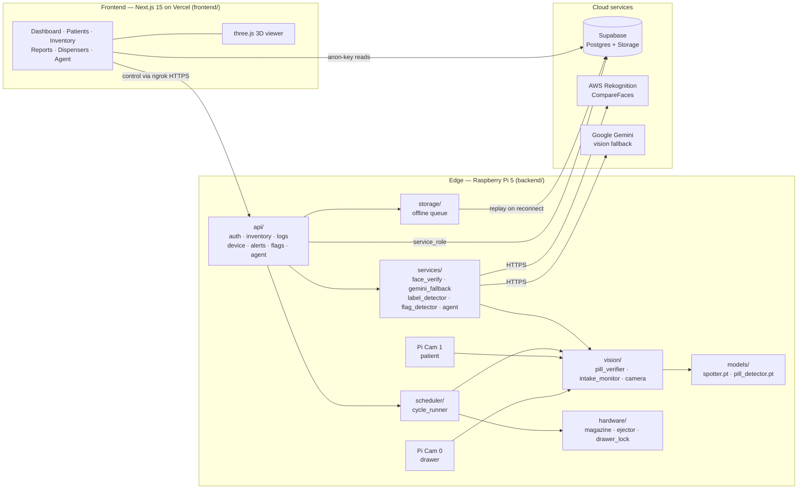
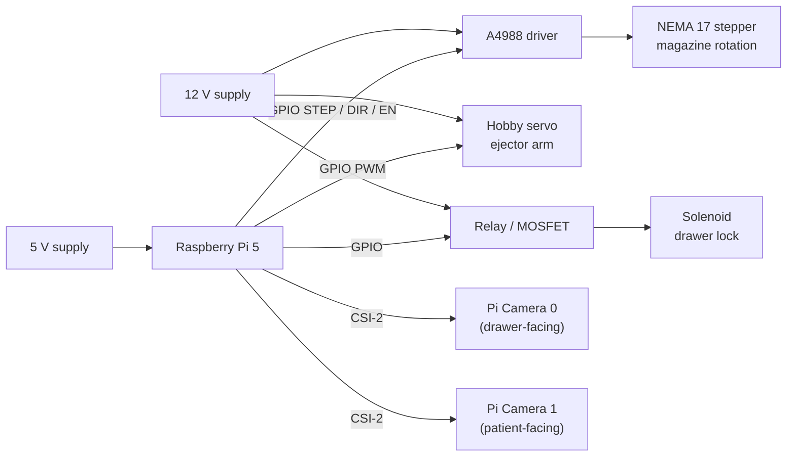

# PharmGuard

PharmGuard smart pill dispenser. Runs three tiers:

- **Edge (Raspberry Pi 5):** FastAPI backend drives stepper magazine + servo ejector + drawer lock, captures Pi Camera frames, runs on-device YOLO (tray empty / pill spotter) and MediaPipe (face + intake FSM) inference, queues telemetry offline when network drops.
- **Cloud backend (FastAPI):** stateless app layer over Supabase (Postgres + Storage). Handles patient verification via AWS Rekognition `CompareFaces`, pill-ID fallback through Google Gemini, and an agent endpoint for natural-language caregiver actions.
- **Frontend (Next.js 15 / React 19):** caregiver dashboard with live dispenser state, 3D viewer of the device, patient/inventory/reports views, and an agent chat. Reads stream from Supabase directly; control actions hit the Pi over an ngrok tunnel.

Contract between tiers is HTTP + Supabase. No shared library.

## Tech stack

### Frontend (`frontend/`)
- Next.js 15 (App Router) on React 19
- Tailwind CSS v4 (`@tailwindcss/postcss`)
- `@supabase/supabase-js` 2.x for direct reads
- SWR for client-side data fetching/caching
- `three` + `@react-three/fiber` + `@react-three/drei` for the 3D dispenser viewer
- TypeScript 5.6

### Backend (`backend/` — runs on Pi and as cloud service)
- FastAPI + Uvicorn, Pydantic v2 (+ `pydantic-settings`)
- Supabase Python client (service-role key)
- `boto3` for AWS Rekognition face verification
- `google-generativeai` for Gemini pill-ID fallback
- `ultralytics` YOLO (`models/pill_detector.pt`, `models/spotter.pt`)
- `mediapipe` 0.10 — FaceMesh + Hands for the 5-step intake FSM
- `opencv-python-headless`, `numpy<2`
- Pi-only (gated by `platform_machine == 'aarch64'`): `picamera2`, `rpi-lgpio` (drop-in `RPi.GPIO` shim for Pi 5 / Bookworm)
- `python-jose` + `passlib[bcrypt]` for auth, `httpx` + `websockets` for I/O

### Hardware
- Raspberry Pi 5, Pi Camera Module
- NEMA 17 stepper + A4988 driver (magazine rotation)
- Servo ejector, solenoid drawer lock
- See `BOM.md` and `HARDWARE_WIRING.md`

### ML (`ml/` — dev workstation only)
- `pill_detector/` — YOLO classifier
- `spotter/` — YOLO detector (tray-empty), deployed to Pi
- `swallow/` — MediaPipe intake prototype; `main5.py` is the canonical FSM spec

### Data / infra
- Supabase (Postgres + Storage) — schema and migrations under `backend/migrations/`
- AWS Rekognition for face match
- Google Gemini for pill-ID fallback
- ngrok tunnel exposes Pi backend to the cloud dashboard

## Architecture

### Software / data flow



### Hardware I/O



Full pin map and wiring photos: `HARDWARE_WIRING.md`. Procurement and unit cost: `BOM.md`.

## Repo layout

- `backend/` — FastAPI app. Subpackages: `api/` (auth, inventory, logs, device, alerts, flags, agent), `services/` (face_verify, gemini_fallback, label_detector, flag_detector, agent + agent_tools), `vision/` (camera, pill_verifier, intake_monitor), `hardware/` (magazine, ejector, drawer_lock, stepper test scripts), `scheduler/` (dispense cycle), `storage/` (offline queue), `models/` (deployed `.pt` weights, tracked in git), `migrations/`.
- `frontend/` — Next.js dashboard. `src/app/` routes: `dashboard`, `patients`, `inventory`, `reports`, `dispensers`, `agent`. Shared `components/` and `lib/` (api + supabase clients).
- `ml/` — Training code, datasets, and notebooks. Not deployed.
- `scripts/` — Repo-level dev setup.
- `BOM.md`, `HARDWARE_WIRING.md` — hardware procurement + wiring reference.
- `Makefile` — top-level entry points.

## Quickstart

### One-time
```
make setup
cp backend/.env.example backend/.env          # Supabase service key, AWS, Gemini
cp frontend/.env.local.example frontend/.env.local
```

### Backend (dev)
```
make backend
```
`uvicorn app.main:app --reload --port 8000` from `backend/`. On macOS set `BACKEND_HEADLESS=1` to skip hardware init.

### Frontend (dev)
```
make frontend
```
`npm run dev` on `:3000`. Other scripts: `npm run build`, `npm run start`, `npm run lint`.

### Both in parallel
```
make dev
```

### Edge Pi

Fresh Pi:
```
make pi-bootstrap HOST=pi@<host>
```
Rsyncs `backend/`, runs `scripts/install.sh` (idempotent), enables `pharmguard.service`. Then edit `~/IDP_PharmGuard/backend/.env` on the Pi and `sudo systemctl restart pharmguard`.

Incremental sync after edits:
```
make pi-sync HOST=pi@<host>
```

Other helpers:
```
make pi-models        # list deployed YOLO weights
make clean-ml         # print disk-freeing hints for ml/ (does not delete)
```

Pi-side logs: `journalctl -u pharmguard -f`.

## Deployment targets

| Component   | Target                                            |
|-------------|---------------------------------------------------|
| `backend/`  | Raspberry Pi 5 (systemd `pharmguard.service`) + cloud host for the stateless API |
| `frontend/` | Vercel (or any Next.js host)                      |
| Database    | Supabase (managed Postgres + Storage)             |
| `ml/`       | Dev workstation only                              |

## Model weights

`backend/models/*.pt` (~37 MB total) are tracked in git so a clean Pi clone is bootable. Training-side weights under `ml/**/*.pt` and large datasets (`ml/datasets/`, `ml/**/Medicine_Images/`) are gitignored. Promotion is manual:

```
cp ml/pill_detector/my_model.pt backend/models/pill_detector.pt
cp ml/spotter/spotter_model.pt  backend/models/spotter.pt
```

Then commit and `make pi-sync`.

## Notes

- No test suite or CI configured. Linting: `npm run lint` for frontend only.
- `BACKEND_URL` in the Pi's `main.py` is currently hardcoded — override in production until env-var support lands.
- Supabase MCP is wired up via `.mcp.json` (project `wqijdqclqhybhdtgsznf`). Prefer `mcp__supabase__*` tools for DB schema work.

## Project evaluation

### Innovation (3 marks)

PharmGuard does not stop at "dispense + remind" like most products on the market — it closes the loop with **on-device computer vision at both ends of the dispense**:

- **Pre-dispense pill verification** — a YOLO `spotter` model checks the tray is empty before rotation and a `pill_detector` model confirms the correct pill landed after ejection. A Google Gemini multimodal fallback catches low-confidence cases.
- **Identity gate via AWS Rekognition `CompareFaces`** — the drawer only unlocks for the registered patient, preventing wrong-person dosing in shared households.
- **5-step intake FSM** (MediaPipe FaceMesh + Hands: HAND → TILT → LEVEL → MOUTH → TONGUE) — actively confirms the pill was *swallowed*, not pocketed. Competing devices (Hero, MedMinder, Livi) log a dispense event but cannot prove ingestion.
- **Natural-language caregiver agent** — `/api/agent` lets caregivers ask "did Mom take her 8 a.m. dose?" in plain English; the agent calls structured tools over the same data plane.
- **Offline-first edge architecture** — Pi-side queue (`storage/`) preserves dispense + intake events through network drops and replays to Supabase on reconnect.
- **3D dispenser viewer** (`three.js` + `@react-three/fiber`) gives caregivers spatial awareness of which magazine slot is loaded with what — beyond the flat tables typical of competing dashboards.

### Relevance to Industry (2 marks)

Medication non-adherence is one of the most expensive solvable problems in healthcare: it is linked to ~125,000 preventable deaths a year in the U.S. and drives hundreds of billions in avoidable admissions globally. The smart pill dispenser market is projected at **USD 3.18–3.93 B in 2026, growing to USD 5–6 B by 2031–2033** (CAGR ~7%) driven by aging populations, the shift to home-based care, and remote-patient-monitoring reimbursement.

PharmGuard sits squarely on three concurrent industry trends:

1. **AI on the edge** — running YOLO + MediaPipe locally on a Pi 5 (no cloud round-trip for inference) matches the industry shift to privacy-preserving, latency-sensitive medical AI.
2. **Connected-care platforms** — Supabase + cloud FastAPI mirror the SaaS caregiver-dashboard model that Hero, MedMinder, and hospital RPM vendors are converging on.
3. **Multimodal verification (vision + biometrics)** — face + pill + intake confirmation matches the FDA's direction on dispensing error reduction and CMS's RPM/CCM billing categories.

### Benchmarking and Standards (3 marks)

| Product            | Subscription / mo | Intake confirmed?              | Self-hostable? |
|--------------------|-------------------|--------------------------------|----------------|
| Hero Health        | $30–$45           | No (dispense event only)       | No             |
| MedMinder          | $50–$125          | No                             | No             |
| Livi               | $99 (+ $130 up)   | No                             | No             |
| Pillo (defunct)    | —                 | No                             | No             |
| **PharmGuard**     | low (BYO hw)      | **Yes — MediaPipe 5-step FSM** | **Yes**        |

Run `make benchmark` (or open `ml/notebooks/benchmark_market_comparison.ipynb`) for the full feature matrix, 3-year TCO, market projections, CV accuracy, **workforce-savings model**, and **projected error-rate + adherence-rate** outcomes. All numbers live in `ml/notebooks/data/*.csv` with citations.

**Applicable standards we are designing toward:**

- **IEC 62304** — medical device software life-cycle. PharmGuard's safety classification would target **Class B** (injury possible, not serious) given dosing involvement; the layered architecture (api ↔ services ↔ hardware) and the offline queue map cleanly onto its clause-5 software development requirements.
- **FDA Class II / 510(k) pathway** — automated medication-dispensing systems are classified as Class II (intermediate risk); IEC 62304 is an FDA-recognized consensus standard usable in a premarket submission.
- **HIPAA** (US) and equivalents (PDPA in Singapore, GDPR in EU) — Supabase row-level security plus AWS Rekognition's BAA-eligible service keep PHI handling defensible. Service-role keys never leave the backend; the frontend only sees scoped anon-key reads.
- **ISO 13485** — quality management system for medical devices; the repo's clear tier boundaries and migration discipline (`backend/migrations/`) are the foundation for a 13485 audit trail.
- **Published CV benchmarks** — recent peer-reviewed pill-recognition systems report ~98% precision / ~95% recall on YOLO-family detectors; our `pill_detector.pt` targets the same envelope on the in-house dataset under `ml/pill_detector/`.

### Commercialization (2 marks)

The architecture is built for two go-to-market motions:

1. **Direct-to-consumer / aged-care home** — a sub-$200 BOM (Pi 5, NEMA 17, A4988, servo, solenoid, Pi Camera; see `BOM.md`) lets us undercut Hero's $30–$45/mo subscription while offering capabilities (intake confirmation, face match) the market leaders do not have.
2. **B2B for assisted-living facilities and hospital med-rooms** — the multi-tenant Supabase backend plus caregiver dashboard scales horizontally; each dispenser is a thin edge node that pushes to a shared schema, so onboarding the 50th device costs the same as the 5th.

Scalability levers already in place:

- **Stateless cloud backend** — every FastAPI route is Supabase-backed, so it scales on Vercel/Fly/Render without sticky sessions.
- **Edge inference** — model weights ship in `backend/models/`; no GPU bill, no per-inference cloud cost.
- **Pluggable ML pipeline** — retraining is decoupled in `ml/`; a new `pill_detector.pt` propagates to every device via `make pi-sync` without code changes.
- **Agent + dashboard as a SaaS surface** — the caregiver web app and `/api/agent` endpoint are the natural subscription product; hardware is a one-time sale.
- **Open standards under the hood** — Postgres, FastAPI, Next.js, ONNX-compatible YOLO weights — no proprietary lock-in, which is a procurement requirement for most healthcare buyers.

Near-term path to revenue: pilot with one aged-care provider → validate intake-confirmation accuracy against nurse-observed ground truth → file for IEC 62304 Class B conformity → expand to insurer-reimbursed RPM coverage.

Sources:
- [SNS Insider — Automatic Pill Dispenser Market to USD 6.26B by 2033](https://www.globenewswire.com/news-release/2026/02/11/3236245/0/en/Automatic-Pill-Dispenser-Market-to-Reach-USD-6-26-Billion-by-2033-Amid-Rising-Demand-for-Smart-Medication-Management-Solutions-SNS-Insider.html)
- [Verified Market Research — Smart Pill Dispenser Market](https://www.verifiedmarketresearch.com/product/smart-pill-dispenser-market/)
- [Mordor Intelligence — Automatic Pill Dispenser Market](https://www.mordorintelligence.com/industry-reports/automatic-pill-dispenser-market)
- [Hero Health — pricing](https://herohealth.com/pricing/)
- [The Senior List — Automated Medication Dispensers comparison](https://www.theseniorlist.com/medication/dispensers/)
- [Springer — Real-time pill identification with deep learning (YOLOv5s)](https://link.springer.com/article/10.1007/s44291-025-00122-6)
- [Pillo medication robot with face recognition](https://mobileidworld.com/archive/medication-robot-face-recognition-107063/)
- [ISO — IEC 62304 medical device software life-cycle](https://www.iso.org/standard/38421.html)
- [FDA — IEC 62304 recognized consensus standard](https://www.accessdata.fda.gov/scripts/cdrh/cfdocs/cfstandards/detail.cfm?standard__identification_no=38829)
- [Greenlight Guru — IEC 62304 safety classifications](https://www.greenlight.guru/glossary/iec-62304)
