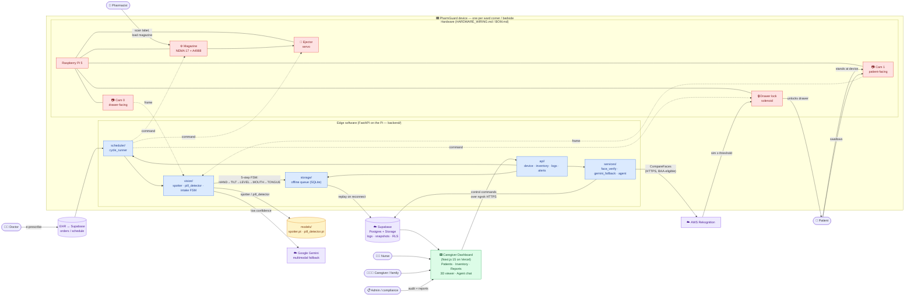

<div align="center">

# 💊 PharmGuard

**A smart pill dispenser that doesn't just dispense — it verifies the right patient took the right pill, and actually swallowed it.**

[](https://www.raspberrypi.com/products/raspberry-pi-5/)
[](https://fastapi.tiangolo.com/)
[](https://nextjs.org/)
[](https://supabase.com/)
[](https://docs.ultralytics.com/)

[Overview](#overview) • [Architecture](#architecture) • [Getting started](#getting-started) • [Deploying to the Pi](#deploying-to-the-pi) • [Configuration](#configuration) • [ML models](#ml-models) • [Hardware](#hardware)

</div>

## Overview

Medication non-adherence is linked to roughly 125,000 preventable deaths a year in the U.S. alone. Commercial dispensers (Hero, MedMinder, Livi) log a *dispense event* — none of them can prove the pill was taken by the right person, or taken at all.

PharmGuard closes that loop with computer vision at every step of the dose:

- 🔒 **Identity gate** — the drawer only unlocks after AWS Rekognition `CompareFaces` matches the patient against their registered reference photo. No override button.
- 💊 **Pill verification** — on-device YOLO models confirm the tray was empty before rotation (`spotter.pt`) and the correct pill dropped after ejection (`pill_detector.pt`), with a Google Gemini multimodal fallback for low-confidence frames.
- 👄 **Intake confirmation** — a MediaPipe FaceMesh + Hands finite-state machine (HAND → TILT → LEVEL → MOUTH → TONGUE) verifies the pill was *swallowed*, not pocketed, hard-gated by a Rekognition label check.
- 📴 **Offline-first** — every event lands in a local SQLite queue first and replays to Supabase on reconnect, so the audit trail survives network drops.
- 🤖 **Caregiver agent** — `/api/agent` answers questions like *"did Mr. Tan take his 8 a.m. dose?"* in plain English and generates scheduled shift-handover briefs.
- 🩺 **Live dashboard** — Next.js app with patient timelines, inventory, alerts, reports, an agent chat, and a 3D viewer of the physical device.

The system spans three tiers that communicate over **HTTP + Supabase** — there is no shared library between them:

| Tier | Stack | Runs on |
|------|-------|---------|
| `backend/` | FastAPI + asyncio hardware supervisor, YOLO (Ultralytics), MediaPipe, RPi.GPIO (via `rpi-lgpio` shim), picamera2 | Raspberry Pi 5 (systemd service); also a dev machine in headless mode |
| `frontend/` | Next.js 15 (App Router), React 19, Tailwind v4, SWR, three.js / react-three-fiber | Vercel (or any Next.js host) |
| `ml/` | YOLO training pipelines, MediaPipe prototype, benchmark notebooks | Dev workstation only — never deployed |

Data lives in **Supabase** (Postgres + Storage); external services are **AWS Rekognition** (face verify + intake labels), **Google Gemini** (pill-ID fallback), **DeepSeek** (caregiver agent), and **ElevenLabs** (nurse-voice TTS for the guided demo).

## Architecture

The diagram reads left → right as the journey of a single dose — from a doctor's order to the audit trail a compliance officer reviews months later. Hardware is red, edge software blue, cloud services purple, frontend green.



### The journey, step by step

1. **Order** — the dose schedule lands in Supabase; the Pi's `scheduler/cycle_runner` polls for the next due dose.
2. **Refill** — the pharmacist loads magazine slots; `label_detector` cross-checks each slot against the active formulary, catching wrong-slot mistakes at refill time, not dispense time.
3. **Identify** — the patient-facing camera frame goes to Rekognition `CompareFaces`. The drawer stays locked below the similarity threshold.
4. **Dispense + verify** — the magazine rotates, the servo ejects, and the drawer-facing camera confirms the right pill dropped. Low-confidence frames escalate to Gemini.
5. **Intake confirm** — the 5-step MediaPipe FSM plus a Rekognition label gate (`Bottle`, `Cup`, `Pill`, …) confirm actual ingestion.
6. **Audit** — every step writes to the local SQLite queue first, then replays to Supabase. Snapshots, similarity scores, FSM transitions, and timestamps are all preserved.
7. **Review + control** — nurses and caregivers watch live state on the dashboard; control commands flow back to the Pi over an ngrok HTTPS tunnel.

## Project structure

```
backend/            FastAPI app — runs on the Pi (and headless on a dev machine)
├── api/            Routers: auth, inventory, logs, device, alerts, flags, agent
├── services/       face_verify, gemini_fallback, label_detector, agent, TTS
├── vision/         camera, pill_verifier (YOLO), intake_monitor (MediaPipe FSM)
├── hardware/       magazine (stepper), ejector (servo), drawer_lock, interlock
├── scheduler/      Dispense cycle + scheduled agent briefs
├── storage/        Offline SQLite event queue
├── models/         Deployed .pt weights (tracked in git, ~37 MB)
├── migrations/     Numbered SQL migrations for Supabase
└── scripts/        install.sh, pi sync, benchmarks, chaos tests

frontend/           Next.js 15 caregiver dashboard
├── src/app/        Routes: dashboard, patients, inventory, reports, dispensers, agent
├── src/components/ Shared UI (incl. 3D dispenser viewer)
└── src/lib/        api.ts (FastAPI client) + supabase.ts (direct reads)

ml/                 Training only — never deployed
├── pill_detector/  YOLO pill classifier training
├── spotter/        YOLO tray-empty detector training
├── swallow/        MediaPipe intake FSM prototype (main5.py = canonical spec)
└── notebooks/      Market & workforce benchmark notebook + data

BOM.md              Bill of materials (sub-$200 build)
HARDWARE_WIRING.md  Pin map + wiring photos
Makefile            All dev entry points
```

## Getting started

### Prerequisites

- **Python 3.11+** and **Node.js 20+**
- A [Supabase](https://supabase.com) project (Postgres + Storage)
- Optional API keys, enabled per feature: AWS Rekognition (face verify + intake labels), Google Gemini (pill-ID fallback), DeepSeek (caregiver agent), ElevenLabs (voice prompts)
- A Raspberry Pi 5 for the full device — **not required** for dashboard/API development

### Setup

```bash
make setup                                          # backend venv + frontend npm install
cp backend/.env.example backend/.env                # fill in Supabase + service keys
cp frontend/.env.local.example frontend/.env.local  # Supabase anon key + device URL
```

Apply the SQL files in `backend/migrations/` to your Supabase project in numeric order.

### Run

```bash
make backend     # FastAPI on :8000 (headless — no GPIO needed)
make frontend    # Next.js on :3000
make dev         # both in parallel
```

> [!NOTE]
> On a dev machine the backend runs with `BACKEND_HEADLESS=1` (set by the Makefile): the HTTP API works fully, but `/api/device/*` endpoints return 503 since there is no GPIO or camera. Set `PHARMGUARD_STUB=1` to simulate the dispense cycle — stub mode never logs `pill_taken=true` by design.

> [!IMPORTANT]
> The Supabase **service-role** key belongs only in `backend/.env` and must never reach the frontend. The frontend uses the scoped **anon** key in `.env.local`. `ELEVENLABS_API_KEY` is likewise backend-only — never expose it as a `NEXT_PUBLIC_*` variable.

## Deploying to the Pi

Bootstrap a fresh Pi (rsync → `install.sh` → enable systemd service, idempotent):

```bash
make pi-bootstrap HOST=pi@<host>
```

Then edit `~/IDP_PharmGuard/backend/.env` on the Pi and restart:

```bash
ssh pi@<host> 'sudo systemctl restart pharmguard'
```

Day-to-day:

```bash
make pi-sync HOST=pi@<host>                 # incremental code sync after edits
ssh pi@<host> journalctl -u pharmguard -f   # tail service logs
```

> [!WARNING]
> The backend must run with **exactly one** uvicorn worker — `RPi.GPIO`, `picamera2`, and `lgpio` hold per-process state, and a multi-worker fork corrupts the hardware. The systemd unit pins `--workers 1`; don't change it.

> [!TIP]
> The free-tier ngrok URL that exposes the Pi to the dashboard rotates on every Pi reboot. After a reboot, update `NEXT_PUBLIC_DEVICE_URL` in the frontend env and redeploy.

## Configuration

All backend settings live in `backend/.env` (see [`.env.example`](backend/.env.example) for the full annotated list). The most important ones:

| Variable | Purpose |
|----------|---------|
| `SUPABASE_URL` / `SUPABASE_KEY` | Supabase project + service-role key |
| `DEVICE_API_KEY` | Shared secret for `/api/device/*` (mirrored as `NEXT_PUBLIC_DEVICE_API_KEY` in the frontend) |
| `AWS_ACCESS_KEY_ID` / `AWS_SECRET_ACCESS_KEY` | Rekognition face verify + intake labels — leave empty to disable both |
| `FACE_SIMILARITY_THRESHOLD` | CompareFaces acceptance threshold (default 80; raise for stricter ID) |
| `INTAKE_LABEL_ENABLED` | Hard-gate intake on Rekognition labels in addition to the MediaPipe FSM |
| `DEEPSEEK_API_KEY` | Enables `/api/agent/*` and scheduled briefs — unset to fully disable |
| `BACKEND_HEADLESS` / `PHARMGUARD_STUB` | Dev-machine modes (no GPIO / simulated hardware) |

> [!CAUTION]
> Enabling the clinician assistant sends patient data (names, conditions, adherence rows) to DeepSeek's API. Review your PHI obligations before setting `DEEPSEEK_API_KEY` in any real deployment.

## ML models

Deployed weights are tracked in git under `backend/models/` (~37 MB) so a clean Pi clone boots without a download step. Training-side weights and datasets under `ml/` are gitignored.

Promoting a new training run is manual:

```bash
cp ml/pill_detector/my_model.pt backend/models/pill_detector.pt
cp ml/spotter/spotter_model.pt  backend/models/spotter.pt
# commit, then:
make pi-sync HOST=pi@<host>
```

The MediaPipe intake FSM in `backend/vision/intake_monitor.py` is a port of `ml/swallow/main5.py` — that script remains the canonical behavioral spec when the two disagree.

## Hardware

A complete unit builds for under $200:

- Raspberry Pi 5 + two Pi Camera modules (patient-facing and drawer-facing)
- NEMA 17 stepper + A4988 driver — magazine rotation
- Servo ejector and solenoid drawer lock

Full pin map and wiring photos in [`HARDWARE_WIRING.md`](HARDWARE_WIRING.md); procurement list and unit costs in [`BOM.md`](BOM.md).

> [!NOTE]
> On Pi 5 / Bookworm, native `RPi.GPIO` does not work. `requirements.txt` installs **`rpi-lgpio`**, a drop-in shim that keeps the `import RPi.GPIO` lines unchanged while using `lgpio` underneath. Don't "fix" the imports.

## How PharmGuard compares

| Product | Subscription / mo | Intake confirmed? | Self-hostable? |
|---------|-------------------|-------------------|----------------|
| Hero Health | $30–$45 | ❌ dispense event only | ❌ |
| MedMinder | $50–$125 | ❌ | ❌ |
| Livi | $99 (+$130 upfront) | ❌ | ❌ |
| **PharmGuard** | **BYO hardware** | ✅ **vision-verified swallow** | ✅ |

Run `make benchmark` (opens `ml/notebooks/benchmark_market_comparison.ipynb`) for the full feature matrix, 3-year TCO, market projections, CV accuracy, and workforce-savings model — all sourced from cited CSVs in `ml/notebooks/data/`.

On the compliance side, the design targets **IEC 62304 Class B** (medical device software life-cycle), the **FDA Class II / 510(k)** pathway for automated dispensing systems, and **HIPAA / PDPA / GDPR** PHI handling — Supabase row-level security plus BAA-eligible Rekognition keep the data path defensible.

## Resources

- [Supabase documentation](https://supabase.com/docs)
- [AWS Rekognition `CompareFaces`](https://docs.aws.amazon.com/rekognition/latest/dg/API_CompareFaces.html)
- [Ultralytics YOLO](https://docs.ultralytics.com/)
- [MediaPipe FaceMesh & Hands](https://ai.google.dev/edge/mediapipe/solutions/guide)
- [IEC 62304 — medical device software life-cycle](https://www.iso.org/standard/38421.html)
- [SNS Insider — automatic pill dispenser market to USD 6.26B by 2033](https://www.globenewswire.com/news-release/2026/02/11/3236245/0/en/Automatic-Pill-Dispenser-Market-to-Reach-USD-6-26-Billion-by-2033-Amid-Rising-Demand-for-Smart-Medication-Management-Solutions-SNS-Insider.html)
- [Real-time pill identification with deep learning (YOLOv5s)](https://link.springer.com/article/10.1007/s44291-025-00122-6)
